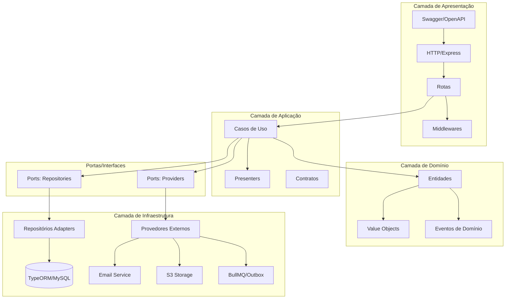
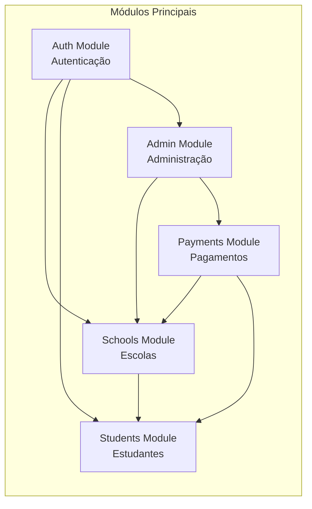
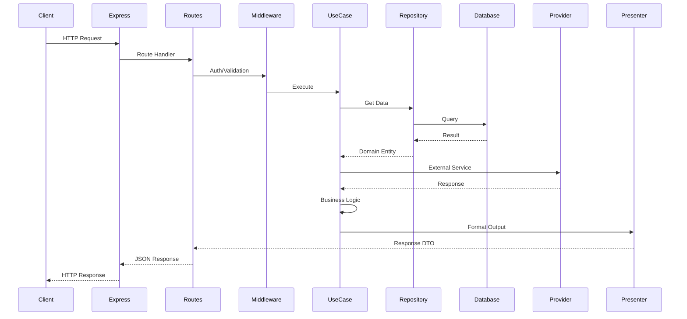
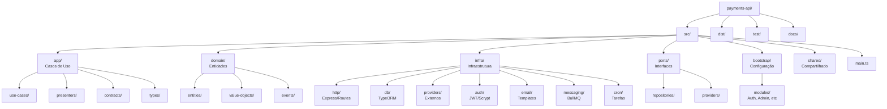
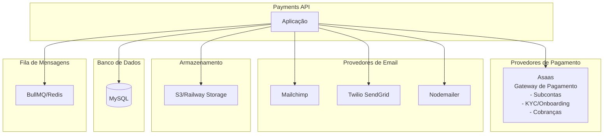
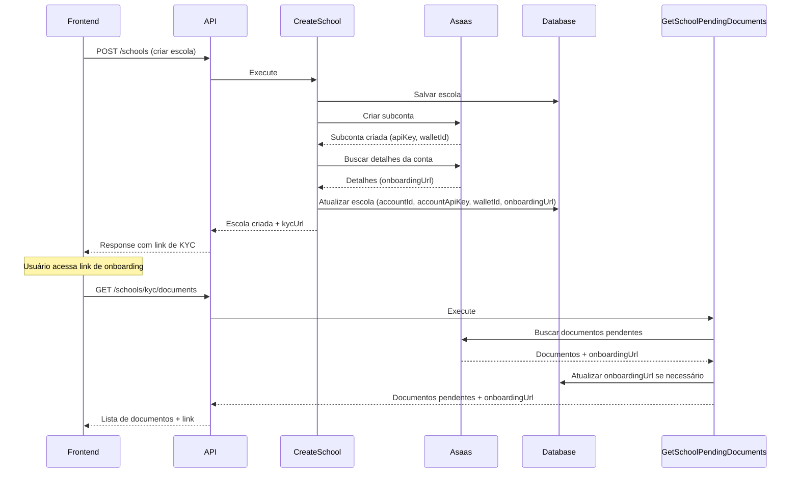
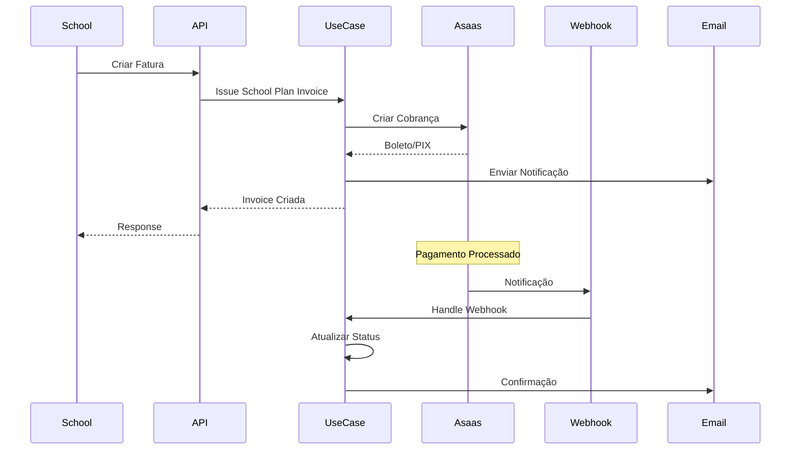
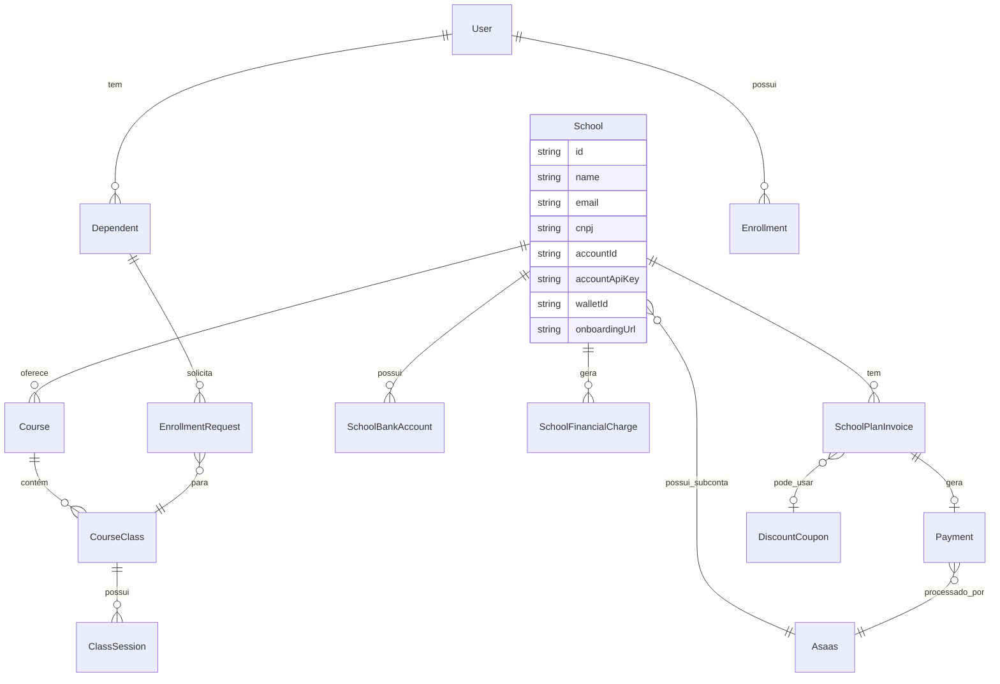
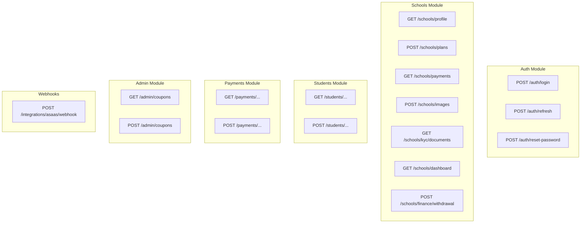

# Diagrama de Arquitetura - Payments API

## Visão Geral da Arquitetura

Este projeto segue os princípios da **Clean Architecture** (Arquitetura Hexagonal), organizando o código em camadas bem definidas com separação de responsabilidades.

## Diagrama de Camadas

## Módulos da Aplicação

## Fluxo de Requisição HTTP

## Estrutura de Diretórios

## Integrações Externas

## Integração com Asaas - KYC e Subcontas

### Criação de Subconta

Quando uma escola é criada, o sistema automaticamente:

1. **Cria uma subconta no Asaas** via `createSubAccount` (em geral após o primeiro pagamento do plano, via worker `EnsureSchoolAsaasAccount`)
   - Envia dados da escola (nome, email, documento fiscal, telefone, endereço, faturamento): **CNPJ** (PJ) ou **CPF do titular + data de nascimento** (PF, quando não há CNPJ — campos `ownerCpf` / `ownerBirthDate`), com `companyType` adequado (ex.: `INDIVIDUAL` para PF) e `birthDate` no Asaas quando aplicável
   - Recebe: `accountId`, `apiKey`, `walletId`

2. **Busca detalhes da conta** via `getAccount`
   - Pode retornar `onboardingUrl` se disponível

3. **Busca documentos pendentes** via `/myAccount/documents` (usando API key da subconta)
   - Aguarda 15 segundos após criação (tempo necessário para processamento)
   - Extrai `onboardingUrl` dos documentos pendentes
   - Atualiza a escola com o `onboardingUrl` encontrado

4. **Salva informações no banco**
   - `accountId`: ID da subconta no Asaas
   - `accountApiKey`: API key da subconta (para operações futuras)
   - `walletId`: ID da carteira digital
   - `onboardingUrl`: Link para completar o KYC

### Endpoints de KYC

- **GET /schools/kyc/documents**: Retorna documentos pendentes e `onboardingUrl`
  - Requer autenticação
  - Usa a API key da subconta para buscar documentos
  - Atualiza `onboardingUrl` se encontrado nos documentos

### Use Cases Relacionados

- **CreateSchool**: Cria escola e subconta no Asaas, retorna `kycUrl`
- **GetSchoolPendingDocuments**: Busca documentos pendentes e `onboardingUrl`
- **GetSchoolProfile**: Retorna perfil da escola incluindo `onboardingUrl`
- **HandleAsaasPaymentWebhook**: Garante que a subconta existe ao processar pagamentos

## Fluxo de Criação de Escola e KYC

## Fluxo de Pagamento

## Entidades Principais do Domínio

No modelo persistido, `cnpj` pode ser **null** quando a escola opera como **pessoa física** (sem CNPJ). Nesse caso o cadastro público exige **`ownerBirthDate`** (YYYY-MM-DD) para integração com a subconta Asaas.

### Níveis, promoções, certificados e timeline por matrícula

O banco inclui tabelas opcionais ligadas à **matrícula** (catálogo de níveis por escola, histórico de promoções, certificados emitidos por promoção, templates de certificado e eventos de timeline). Não existe nível “global do aluno”: o estado vigente e o histórico referem-se sempre a `enrollment_id`. Detalhes, diagrama e políticas de FK: [modelo-niveis-certificados-timeline-matricula.md](./modelo-niveis-certificados-timeline-matricula.md).

## Módulos e Rotas

## Padrões de Design Utilizados

- **Repository Pattern**: Abstração de acesso a dados
- **Adapter Pattern**: Adaptadores para provedores externos
- **Use Case Pattern**: Casos de uso isolados
- **Dependency Injection**: Injeção de dependências via construtores
- **Outbox Pattern**: Para mensagens assíncronas
- **Module Pattern**: Módulos independentes e configuráveis
- **Provider Pattern**: Abstração de serviços externos (Asaas, Email, Storage)

## Casos de Uso Principais

### Módulo de Escolas

- **CreateSchool**: Cria uma nova escola e subconta no Asaas
  - Valida dados de entrada
  - Cria subconta no Asaas
  - Busca `onboardingUrl` para KYC
  - Salva escola no banco com dados do Asaas
  - Retorna `kycUrl` para o frontend

- **GetSchoolProfile**: Retorna perfil completo da escola
  - Inclui dados básicos, endereços, contas bancárias, imagens
  - Inclui `onboardingUrl` para KYC
  - Calcula status de inadimplência

- **GetSchoolPendingDocuments**: Busca documentos pendentes de KYC
  - Usa API key da subconta para buscar documentos
  - Extrai `onboardingUrl` dos documentos
  - Atualiza escola se encontrar novo `onboardingUrl`

- **UpdateSchool**: Atualiza dados da escola
- **HandleAsaasPaymentWebhook**: Processa webhooks do Asaas
  - Garante que subconta existe antes de processar pagamento

## Tecnologias Principais

- **Runtime**: Node.js
- **Framework**: Express.js
- **ORM**: TypeORM
- **Database**: MySQL
- **Autenticação**: JWT (HMAC)
- **Validação**: Zod
- **Documentação**: Swagger/OpenAPI
- **Fila de Mensagens**: BullMQ
- **Storage**: AWS S3 / Railway Storage
- **Email**: Mailchimp / SendGrid / Nodemailer
- **Testes**: Vitest
- **Gateway de Pagamento**: Asaas (subcontas, KYC, cobranças)

## Scripts de Teste

O projeto inclui scripts para testar funcionalidades específicas:

- **test:kyc**: Testa o fluxo completo de KYC do Asaas
  - Cria subconta diretamente no Asaas
  - Aguarda processamento (15s)
  - Busca documentos pendentes
  - Extrai e exibe `onboardingUrl`

- **test:create-school**: Testa criação de escola via API
  - Cria escola via POST /schools
  - Verifica criação de subconta
  - Valida salvamento de dados (accountId, apiKey, walletId, onboardingUrl)
  - Testa rota de documentos pendentes

## Estrutura de Dados - School Entity

A entidade `School` inclui campos relacionados ao Asaas:

- `accountId`: ID da subconta no Asaas
- `accountApiKey`: API key da subconta (para operações autenticadas)
- `walletId`: ID da carteira digital no Asaas
- `onboardingUrl`: Link para completar o processo de KYC/onboarding

Esses campos são preenchidos automaticamente durante a criação da escola e podem ser atualizados quando documentos pendentes são verificados.

